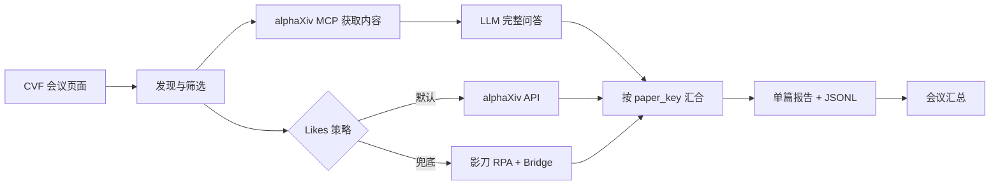

<div align="center">

# Conference Paper Research Agent

**基于 AutoGPT 的顶会论文自动研究流水线**

自动发现论文、采集 alphaXiv 热度、批量完成 AI 问答，并逐篇即时保存 Markdown 报告。

[](https://github.com/Significant-Gravitas/AutoGPT)
[](https://www.python.org/)
[](https://docs.docker.com/compose/)
[](docs/README.md)

[快速开始](#快速开始) · [核心源码](src/README.md) · [运行手册](docs/runbook.md) · [设计规格](docs/spec.md)

</div>

## 项目概述

面对数千篇顶会论文，逐篇检查 arXiv、查看热度、阅读全文并重复提问非常耗时。本项目在 **AutoGPT Platform** 上实现了一条可视化、可并行、可恢复的论文研究 Agent：输入会议年份和研究问题，即可自动生成带 Likes 与完整问答的单篇报告。

当前初版支持 **CVPR 2026 全量处理**。它是 AutoGPT 的二次开发扩展，不包含无关的 AutoGPT 上游源码；通过安装脚本接入指定版本的官方框架。

## 核心能力

- **论文发现**：从 CVF Open Access 抓取、合并并去重论文，识别页面自带的 arXiv 链接。
- **完整问答**：通过 alphaXiv MCP 获取论文内容，每篇只调用一次 LLM 回答全部问题。
- **热度采集**：默认并发读取 alphaXiv metadata API，保留影刀 RPA 作为可切换兜底。
- **并行流水线**：AI 分析与 Likes 采集并行执行，并采用分批调度控制资源。
- **即时落盘**：每篇完成后立即保存 checkpoint、JSONL 和独立 Markdown 报告。
- **断点续跑**：中断后复用同一个 `run_id`，自动跳过已成功论文。

## 工作原理



## 目录说明

| 目录 | 内容 | 是否核心 |
|---|---|:---:|
| [`src/`](src/README.md) | 论文 Agent 的 Python Block、并发调度、断点保存、报告生成与 RPA Bridge | **是** |
| [`agent/`](agent/README.md) | 可直接导入 AutoGPT Builder 的 Graph JSON | **是** |
| [`scripts/`](scripts/README.md) | 将本项目安装到 AutoGPT 的一键脚本 | **是** |
| [`patches/`](patches/README.md) | Graph Schema、MCP OAuth、执行器与数据卷等框架适配 | **是** |
| [`docs/`](docs/README.md) | 中文运行手册、设计规格与排错指南 | 文档 |
| [`shadowbot/`](shadowbot/README.md) | 可选的影刀 Likes 采集契约 | 可选 |
| [`fixtures/`](fixtures/README.md) | 不含账号和密钥的离线测试样本 | 测试 |

> 想直接看项目实现，请从 [`src/conference_paper/`](src/conference_paper/) 开始。

## 快速开始

### 1. 获取官方 AutoGPT 与本扩展

需要 Git、Python 3.10+、Docker Desktop，以及至少 8 GB 内存（推荐 16 GB）。

```powershell
git clone https://github.com/Significant-Gravitas/AutoGPT.git
git -C AutoGPT checkout 6dcf0e22f84ce49c289adec4504a3d4ec186bb3a

git clone https://github.com/ly-rrrrr/AutoGPT-Conference-Paper-Agent.git
cd AutoGPT-Conference-Paper-Agent
```

### 2. 安装扩展

```powershell
python scripts/install.py --autogpt-root "..\AutoGPT"
```

脚本会检查 AutoGPT 目录和兼容版本，应用必要补丁，并安装领域 Block、Bridge 与可导入 Agent。它不会复制 API Key 或运行结果。

### 3. 配置模型服务并启动

在 `AutoGPT/autogpt_platform/.env` 中配置 OpenAI-compatible 服务地址，例如：

```dotenv
OPENAI_BASE_URL=https://api.openai.com/v1
```

然后启动：

```powershell
cd ..\AutoGPT\autogpt_platform
docker compose up -d --build
docker compose ps
```

打开 [http://localhost:3000](http://localhost:3000)，在 Platform 中登录。API Key 只通过 Platform Credential 添加，**不要写入仓库或截图**。

### 4. 导入 Agent

在 **Build → Import** 中导入安装后的文件：

```text
autogpt_platform/backend/agents/conference-paper-research-agent.json
```

为 `Analyze Conference Papers` 节点连接：

1. alphaXiv MCP OAuth；
2. OpenAI-compatible API Key。

Graph 默认模型为 `gpt-5.6-luna`；如果你的服务不支持它，请在节点中换成可用模型。

### 5. 先做小批量试跑

点击 **Manual Run**，使用：

```json
{
  "conference": "CVPR",
  "year": 2026,
  "run_id": "cvpr-2026-smoke-01",
  "topics": [],
  "max_papers": 3,
  "likes_strategy": "alphaxiv_api",
  "analysis_concurrency": 3,
  "paper_questions": [
    "这篇论文解决了什么研究问题？",
    "总结核心方法、主要贡献、关键实验结果与局限性。"
  ]
}
```

确认生成 3 份单篇报告后，把 `max_papers` 改为 `0`、换一个新的 `run_id`，即可进行 CVPR 2026 全量处理。

## 运行产物

```text
AutoGPT/projects/conference-paper-research-agent/data/runs/<run_id>/
├── analysis-checkpoint.jsonl  # 分析断点，逐篇追加
├── likes-checkpoint.jsonl     # Likes 断点，逐篇追加
├── qa-results.jsonl           # 问题与完整回答
├── paper-results.jsonl        # 汇合后的最终结果
├── likes-results.jsonl        # Likes 结果
├── manifest.json              # 运行状态与统计
├── conference-summary.md      # 会议汇总
└── reports/<arxiv_id>.md      # 每篇即时生成的独立报告
```

运行中断后保持问题配置不变，并复用同一个 `run_id` 再次运行，系统会从 checkpoint 继续。

## Likes 双策略

| 策略 | 适用场景 | 特点 |
|---|---|---|
| `alphaxiv_api` | 日常批量运行 | 默认、快速，无需浏览器或 Bridge |
| `shadowbot` | API 变化或 UI 复核 | 拟人化读取页面，资源开销更高 |

影刀不是默认依赖。只有切换到 `shadowbot` 时，才需要按照[影刀兜底指南](docs/shadowbot-likes-worker.md)启动 Bridge 与 Worker。

## 开发与验证

安装到 AutoGPT 后，在 `autogpt_platform/backend` 运行：

```powershell
poetry run pytest backend/blocks/conference_paper -q
```

当前发布版定向测试结果：**147 passed**。

## 安全与许可

- 不要提交 API Key、OAuth Token、`.env`、Bridge 数据库或全量运行结果。
- alphaXiv、CVF、arXiv 与模型服务受各自条款约束，请控制请求频率。
- 本项目是基于 AutoGPT Platform 的派生扩展，遵循 **PolyForm Shield License 1.0.0**；详情见 [LICENSE](LICENSE) 和 [NOTICE.md](NOTICE.md)。
- 本仓库使用独立提交历史，仅用于清晰展示本项目的二次开发内容；AutoGPT 上游作者及贡献归属仍属于原项目。

## 致谢

感谢 [AutoGPT](https://github.com/Significant-Gravitas/AutoGPT)、[CVF Open Access](https://openaccess.thecvf.com/)、[arXiv](https://arxiv.org/) 与 [alphaXiv](https://alphaxiv.org/) 提供的基础设施和内容入口。

---

<div align="center">

如果这个项目对你有帮助，欢迎 Star、Fork 或提交 Issue。

</div>

